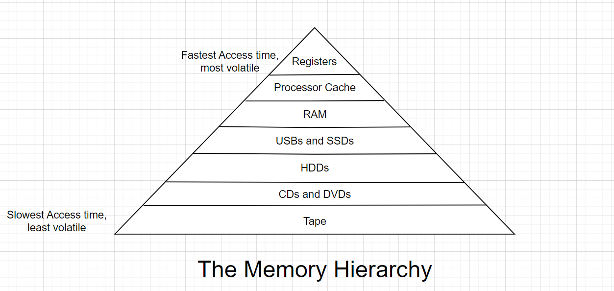

# Memory vs Storage and Memory Hierarchy

Any medium that can record information can be turned into either working memory for processors or storage for safekeeping software (or as something inbetween which we discuss in a bit). However for specialized computers we have to specialized storage and specialized memory. This results in different types of hardware that have different access times, different capacity for the same price, and different volatility, forming a **Memory Hierarchy** as seen below.

Let's discuss the hierarchy tiers in more detail.

In chapter 4 we built a small memory that was directly integrated into the processor, then tweaked the opcode circuits to treat it as 4 slots of temporary memory, enabling our calculator to run chained math operations. This type of memory is the fastest to use because it's directly integrated into the processor and electricity doesn't have to run through long wires to reach the processor. We call each of the slots the memory is divided into a **Register** because it is designed to register a single number for usage by the program.[^1]

Adding a lot of Registers to processors (say, for programs dealing with Matrix math) is inefficient because additional money has to go into redesigning the processor with the new registers, and the opcodes often have to be optimzied to use every register available. We can go around this by keeping the number of registers minimal and instead making a larger memory chunk connected to the processor with a bunch of wires. This way the program can store numbers that will be needed for the next bunch of instructions in registers, and use the larger memory for every other data that won't be needed for a while.
The Larger memory can be thought as an array of one-byte slots. Where each slot's array index is the **Address** of said slot. Opcodes are then added to the processor for loading bytes from the main memory into registers and storing register content into memory if they aren't needed. To optimize memory access further, it is designed so the processor can access data from any random address in the memory (as opposed to having to manually step through the addresses to reach the desired address). This kind of large memory is thus called **Random Access Memory** (RAM).

Many modern CPUs optimize memory access even further by checking how much certain addresses are accessed, making a copy of all the data in and around those addresses, and storing them in a larger temporary memory sitting next to Register memory. This secondary processor memory is called **Processor Cache** because important RAM data is cached into it.

The RAM, the Processor Cache, and the Processor Registers are volatile memory, any data stored inside them is wiped the moment electricty is cut off. But Storage devices lower in the Memory Hierarchy can keep the data for far longer as they don't need electricity keep their data in.

USBs and SSDs have faster access than magnetic tape based HDDs at the cost of being more expensive for the same capacity. HDDs are in turn faster and more expensive than CDs/DVDs, which are in turn faster and more expensive than actual tape.

> Operating Systems in modern PCs have options to treat Storage space as extra memory (called Virtual memory), and treat Memory space as Storage space (called RAMDisks because they always use RAM space). But these come with the limitations of the hardware (RAMDisks get erased when the computer is turned off, using Virtual memory slows the computer down).

One way we can use the memory hierarchy to improve performance is executing programs from memory instead of storage. This lets CPUs use the higher access speed of RAMs to execute programs faster. 
In fact that's how every modern CPU works nowadays. The Operating System always copies the program that's going to be executed into memory and tells the CPU to start at the first function to execute (we'll talk more about this in the advanced RE guide). The concept is so important that the computers implementing it are classified with a fancy name: **Stored Program Computers**.

[^1]: Remember Words from chapter 2.2? Each register in most CPU designs can only store up to one word of data.